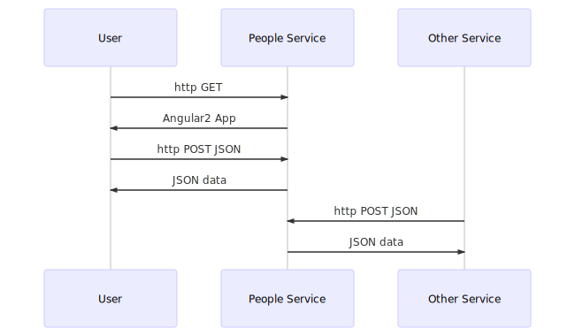

[](https://www.npmjs.org/package/people-service)


# A People Micro-Service based on Node.js, Angular2, and NativeScript

All code is in TypeScript!

*This is a work in progress. All comments are welcome!*


## Technologies
This project uses:

| Tech | Name/Web-site | Version 
|--------|:---------|:---------|
|  | [TypeScript](https://www.typescriptlang.org/) | ~2.0.0 |
|  | [Node.js](https://nodejs.org/en/) | 5.12.0 |
|  | [Angular2](https://angular.io/) | 2.0.0-rc.5 |
|  | [Express.js](https://expressjs.com/) | 4.14.0 |
|  | [MongoDB](https://www.mongodb.com/) | 3.2.0 |
|  | [NativeScript](https://www.nativescript.org/) | 2.1.1 |
|  | [Mocha](https://mochajs.org//) | 3.0.2 |
|  | [Protractor](http://www.protractortest.org/) | 3.3.0 |
|  | [Karma](http://karma-runner.github.io/1.0/index.html) | 1.2.0 |
|  | [npm](https://www.npmjs.com/) | 3.8.6 |
|


## Overview
This project provides a working example of a complete, non-trivial data service, handling data describing individual people.

*people-service includes:
- a **server** that:
  - serves an Angular2 web-app
  - provides an API for managing the data
- an Angular2 **web-app for administration**
- an Angular2 **web-app for user access**
- **database adaptors** that plug-in, and are programmatically selectable, for:
  - a simple **in-memory database** for testing only
  - a **MongoDB database, with mongoose** data schema, for all persistent data use cases, including production
- a **mobile app** for displaying data to a user
- **automated tests** for:
  - the server
    - using mocha, internally, without a server running
    - externally, with a server running, via its API
  - database access
    - shared [document-database-tests](https://github.com/psnider/document-database-tests) for:
      - in-memory database adaptor
      - MongoDB database adaptor
      - people-service (database access functions)
  - the web-app
    - ~~using Karma currently, this is broken, see notes below~~
  - end-to-end
    - using mocha
    - using protractor

This does not include:
- user authentication  
  See [passport](https://www.npmjs.com/package/passport) if you need authentication.

This template is nearly finished, and should be usable, for most micro-services.
Just modify the data descriptions to make a new service.

## Features
This micro-service:
- [x] Uses TypeScript for the server, the browser, and for mobile  
making it easier to configure.
- [x] Uses best-practices testing for server, client, and end-to-end.  
Uses mocha for the server, karma for the client, and protractor for end-to-end.  
:warning: karma for angular2 is broken as of v2.0.0-rc.5 and rc.6  
See [karma support will be added to quickstart](https://github.com/angular/quickstart/issues/208#issuecomment-245654108)  
and get help from [Karma Gitter](https://gitter.im/karma-runner/karma)
- [x] has a simple web UI using Angular2
- [x] Uses npm scripts for (automated) building and testing.  
*We used to use gulp, but it added a level of indirection, and still required much more work than the npm scripts that we use now.*
- [x] Uses the express micro-service framework on the server.  
- [x] has a [mobile-app in NativeScript](https://github.com/psnider/people-mobile) for Android and iOS
- [x] stores its data in mongodb.  
*mongodb* is schema-less, and easy for development.
- [x] automates deployment.  


## Network Connections

**Here's a sequence diagram showing how people-service fits into a system:**


## Setup for Build
This will take about 3 minutes:
```
npm install
```


## Build
Build all of the software:  
```
npm run build
```

Build a sub-project:  
```
npm run build-browser-angular2
npm run build-server
```


## Test
Build and test all of the software:  
```
npm run test
```

Build and test a sub-project:  
- Test the server internals standalone using mocha.  
```
npm run test-server
```  
- Test the angular.js client in a Chrome browser using jasmine and karma.  
:warning: Karma testing doesn't work yet. See other notes.
```
npm run test-browser-angular2
```  
- Test the server from a Chrome browser using protractor with selenium.  
```
npm run test-end-to-end-static
npm run test-end-to-end-live
```  


## Run the Service
```
npm run start-servers
```
This will start the server, with logs saved in the *./logs* directory.

## Stop the Service
```
npm run stop-servers
```

## Exercise the Service

Note that these commands are similar to the ones in the automated end-to-end tests.

Use **curl** to create a *Person* record:
```
curl -H "Content-Type: application/json" -X POST -d '{"action":"create", "obj":{"name":{"given":"Sally","family":"Smith"}}}' http://localhost:3000/api/people
```
This command will return the created Person record, with its *_id*.
Use this *_id* for your subsequent queries. In the examples below, the id was *5803c7396dc69c29557c92a5*.

Use **curl** to read a *Person*
```
curl -H "Content-Type: application/json" -X POST -d '{"action":"read", "query":{"ids":["5803c7396dc69c29557c92a5"]}}' http://localhost:3000/api/people
```

Use **curl** to update a *Person* and then read back the updated *Person*
```
curl -H "Content-Type: application/json" -X POST -d '{"action":"update","query":{"conditions":{"_id":"5803c7396dc69c29557c92a5"}},"updates":[{"cmd":"set","field":"name.given","value":"Joe"}]}' http://localhost:3000/api/people
```

Use **curl** to delete a *Person* record and then confirm that read no longer returns that *Person*
```
curl -H "Content-Type: application/json" -X POST -d '{"action":"delete", "query":{"ids":["5803c7396dc69c29557c92a5"]}}' http://localhost:3000/api/people
curl -H "Content-Type: application/json" -X POST -d '{"action":"read", "query":{"ids":["5803c7396dc69c29557c92a5"]}}' http://localhost:3000/api/people
```

Use **curl** to find all of the *Person* records.
```
curl -H "Content-Type: application/json" -X POST -d '{"action":"find", "query":{"conditions":{}}}' http://localhost:3000/api/people
```

## Exercise the Client
For now, it looks pretty much like the Angular2 Tour-of-Heroes tutorial:

The cloud instance on Joyent:
```
http://72.2.119.140:3000
```

Your local instance (for development):
```
http://localhost:3000
```


## Deploy
You must first set up your cloud host machine manually on Joyent.
These [rough notes](doc/cloud-joyent.md) may help you.

After the host machine is setup, just run:
```
npm run deploy-production-to-joyent
```

## Support
If you have any questions, suggestions, or problems,
please email me at my address given on npm, or file an issue.
