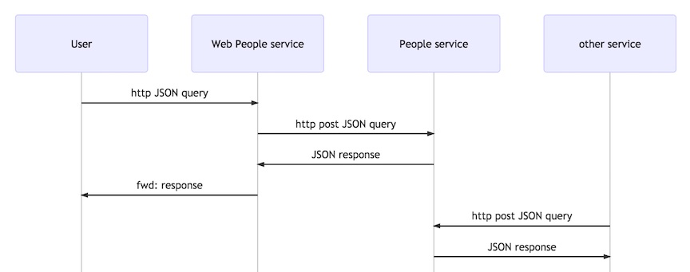

[](https://www.npmjs.org/package/people-service)
[](https://www.npmjs.org/package/people-service)


# A People Micro-Service based on Seneca

This is a work in progress, as I try to learn and use seneca.

I'm writing a non-trivial People micro-service that:
- [x] uses the seneca micro-service framework
- [ ] stores its data in mongodb  
- [ ] has a simple web UI using angular.js

Note that only the service exists so far, and the mongodb data store, and and the angular.js UI haven't been started

## People Service

The main logic is in the *seneca* plugin [src/ts/people-plugin.ts](src/ts/people-plugin.ts), which is contained in the People service.

The People service consists of three parts:  
- A People service  .
This takes a JSON request, looks up a Person from their ID, and returns it.
- A seneca adaptor for an in-memory database (seneca-mem-store).
- A Web API proxy for the People service  
This takes a JSON request, and passes a JSON request to the people service.

**Here's a sequence diagram showing how this fits into a system:**


## Setup for Build
```
make setup
```

## Build
```
make build
```

## test
```
make test
```

## Build and test
```
make
```


# Run the Service and Web API Server
In a command shell, run:
```
bin/start-servers.sh --log
```
This will start both servers in the same shell, with plugin logging.
Note that both logs will be combined.

# Stop the Service and Web API Server
In a command shell, run:
```
bin/stop-servers.sh
```

## Exercise the Service

Use **curl** to create some *Person* records:
```
curl -H "Content-Type: application/json" -X POST -d '{"action":"create", "person":{"name":{"given":"Sally","family":"Smith"}}}' http://localhost:3000/api/people
curl -H "Content-Type: application/json" -X POST -d '{"action":"create", "person":{"name":{"given":"Bob","family":"Brown"}}}' http://localhost:3000/api/people
```
These commands will return the created Person records, with their IDs.
Use these IDs for your subsequent queries. In the examples below, the id was *abcdef*.

Use **curl** to read a *Person*
```
curl -H "Content-Type: application/json" -X POST -d '{"action":"read", "person":{"id":"abcdef"}}' http://localhost:3000/api/people
```

Use **curl** to update a *Person* and then read back the updated *Person*
```
curl -H "Content-Type: application/json" -X POST -d '{"action":"update", "person":{"id":"abcdef", "shoe_size": 8}}' http://localhost:3000/api/people
curl -H "Content-Type: application/json" -X POST -d '{"action":"read", "person":{"id":"abcdef"}}' http://localhost:3000/api/people
```


Use **curl** to delete a *Person* record and then confirm that read no longer returns that *Person*
```
curl -H "Content-Type: application/json" -X POST -d '{"action":"delete", "person":{"id":"abcdef"}}' http://localhost:3000/api/people
curl -H "Content-Type: application/json" -X POST -d '{"action":"read", "person":{"id":"abcdef"}}' http://localhost:3000/api/people
```

Use **curl** to delete a *Person* record and then confirm that read no longer returns that *Person*
```
curl -H "Content-Type: application/json" -X POST -d '{"action":"delete", "person":{"id":"abcdef"}}' http://localhost:3000/api/people
curl -H "Content-Type: application/json" -X POST -d '{"action":"read", "person":{"id":"abcdef"}}' http://localhost:3000/api/people
```


# Support
If you have any questions, suggestions, or problems,
please email me at my address given on npm, or file an issue.
